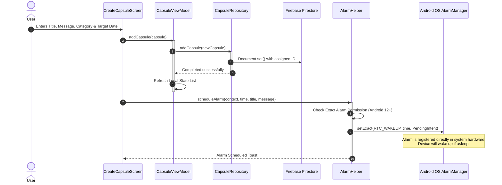

# 🌌 LegacyVault — Comprehensive Project Engineering & Architectural Report

> **Preserve your memories, thoughts, and reflections in a secure digital vault—to be opened only when the designated future moment arrives.**

---

## 📋 1. Executive Summary & Value Proposition

**LegacyVault** is a premium, secure Android application designed to bridge the gap between human emotion and digital storage. Operating as a state-of-the-art **digital time capsule**, it provides a space for users to lock away personal statements, letters, and motivational checkpoints, securing them until a precise future date and time. 

Unlike traditional diary or note-taking apps, LegacyVault's core philosophy centers around **temporal discipline**. A sealed capsule is completely locked, hiding its message and rendering a ticking countdown down to the exact second. Once the designated unlock time passes, system-level broadcast receivers and background synchronization tasks transition the capsule's state, alerting the user and initiating an emotional retrospective log.

By combining modern **Jetpack Compose declarative UI**, **Firebase cloud replication**, and system-level scheduling frameworks, LegacyVault serves as a blueprint for professional Android engineering.

---

## 📊 2. Engineering Dimension Dashboard

| Dimension | Implementation Details |
| :--- | :--- |
| **Architecture Pattern** | Pure MVVM (Model-View-ViewModel) + Repository Pattern with unidirectional data flows |
| **Language & Concurrency**| Kotlin `v2.3.21` utilizing Coroutines, StateFlow streams, and asynchronous deferred tasks |
| **Declarative UI Engine** | Jetpack Compose BOM `2026.05.00` with Material Design 3 (M3) support |
| **Primary Cloud Backend** | Firebase Firestore (Realtime Synchronized NoSQL Document Database) |
| **Authentication System** | Firebase Authentication (Email/Password credentials and session persistence) |
| **System-Level Scheduling**| Native Android `AlarmManager` with high-accuracy exact wakeups (`RTC_WAKEUP`) |
| **Background Sync Daemon** | Android `JobScheduler` running `CapsuleJobService` for resilient background synchronization |
| **Local Cache & Storage** | Jetpack DataStore (Preferences API) combined with `Kotlinx Serialization JSON` |
| **Dynamic Typography** | Custom Montserrat and Outfit styling, powered by dynamic theme scales |
| **UI Aesthetics & Themes** | Custom high-contrast Deep-Space dark mode palette |

---

## 🏗️ 3. System Architecture & Reactive Workflows

LegacyVault utilizes a modern, reactive MVVM architecture. The data flows are strictly controlled: UI screens subscribe to state streams exposed by ViewModels, which in turn coordinate data fetch requests from Firestore repositories and local preferences.

### 3.1 Architectural Layout & Component Interactions
```mermaid
graph TD
    subgraph UI Layer (Jetpack Compose)
        A[Screens: LockScreen, OpenedScreen, etc.] -->|Observe State| B[CapsuleViewModel]
        B -->|Expose StateFlow| A
    end

    subgraph Business Logic & VM Layer
        B -->|Fetch / Sync / Save| C[CapsuleRepository]
        B -->|Get Settings / Cache| D[PreferenceManager]
    end

    subgraph Data & Cloud Layer
        C -->|CRUD Queries| E[(Firebase Firestore)]
        D -->|Read / Write Preferences| F[(Jetpack DataStore)]
    end

    subgraph System-Level OS Engines
        G[AlarmHelper] -->|Schedules Exact Alarms| H[(Android OS AlarmManager)]
        H -->|Broadcast Triggers| I[AlarmReceiver]
        I -->|Vibrations & Push Banners| J[NotificationHelper]
    end

    A -->|Trigger Alarm Setup| G
```

---

### 3.2 Real-time Sequence: Capsule Creation & Scheduling Flow

When a user creates a new time capsule, it is simultaneously persisted in the cloud database and scheduled as an exact hardware alarm on the Android operating system.



---

### 3.3 Background Sequence: Temporal Unlocking & UI Evolution

Even if the app is killed, the Android system wakes up the app when the alarm is reached. If the app is in the foreground, an active ticker transitions the capsule instantly.

```mermaid
sequenceDiagram
    autonumber
    participant OS as Android OS AlarmManager
    participant Recv as AlarmReceiver
    participant Note as NotificationHelper
    participant User
    participant VM as CapsuleViewModel
    participant DB as Firebase Firestore
    participant View as LockScreen/OpenedScreen

    Note over OS: Unlock Time Reached!
    OS->>Recv: Send Broadcast Intent
    activate Recv
    Recv->>Note: showNotification(context, title, message)
    activate Note
    Note->>Note: Initialize High-Priority Channel
    Note-->>User: Pushes Rich Push Notification
    deactivate Note
    deactivate Recv

    Note over VM: Running background Coroutine tick (1000ms interval)
    VM->>VM: Detects currentTime >= capsule.openTime
    activate VM
    VM->>DB: Update document in Firestore (isOpened = true)
    VM->>VM: Emit new capsule list via StateFlow
    deactivate VM
    
    VM-->>View: StateFlow updates list
    activate View
    View->>View: Slide Capsule from Locked tab to Opened tab with animation
    deactivate View
```

---

## 📁 4. Technical Module & File Analysis

The LegacyVault project is structured using modern package-by-feature and layer separation guidelines. Below is an inspection of all critical modules with direct links to the code resources:

### 4.1 Core Domain Layer
*   [Capsule.kt](file:///d:/app/app/src/main/java/com/timecapsule/app/data/model/Capsule.kt): Contains the core database entity modeling a time capsule. 
    *   `id`: String representing the unique Firestore document ID.
    *   `ownerId`: Firebase authentication UID of the capsule creator.
    *   `title` / `message`: Text content of the sealed note.
    *   `type`: Categorization scheme (`Personal`, `Motivation`, `Reminder`).
    *   `openTime`: Epoch millisecond timestamp of the unlock date/time.
    *   `isOpened`: Boolean state controlling locker access.
    *   `emotion`: Optional integer mapping representing user feedback.
    *   `unlockKey`: Optional pin/password key to bypass unlocking.
    *   `sharedUsers`: List of emails of users that can view this capsule.

---

### 4.2 Data Storage & Cache Layer
*   [CapsuleRepository.kt](file:///d:/app/app/src/main/java/com/timecapsule/app/data/model/repository/CapsuleRepository.kt): Serves as the abstraction interface over Firebase Firestore. It exposes CRUD utilities:
    *   `addCapsule(capsule)`: Creates a new Firestore document with auto-generated ID or overwrites an existing one.
    *   `getAllCapsulesForUser(userId)`: Query constraint retrieving capsules matching the user's login ID.
    *   `getSharedCapsules(email)`: Query constraint extracting shared capsules where the current user's email is present in the `sharedUsers` array.
*   [PreferenceManager.kt](file:///d:/app/app/src/main/java/com/timecapsule/app/data/datastore/PreferenceManager.kt): Manages local settings using Android **Jetpack DataStore**.
    *   Stores user options like dark mode preferences using `booleanPreferencesKey("dark_mode")`.
    *   Caches serialized capsule JSON blocks for resilient offline startup using `stringPreferencesKey("capsules_json")` and Kotlinx Serialization.

---

### 4.3 ViewModels & State Management
*   [CapsuleViewModel.kt](file:///d:/app/app/src/main/java/com/timecapsule/app/viewmodel/CapsuleViewModel.kt): The primary data manager and orchestrator of state logic.
    *   Exposes a read-only state stream `capsules` of type `StateFlow<List<Capsule>>`.
    *   Initializes a constant asynchronous check daemon within `viewModelScope` that runs an infinite coroutine loop. Every `1000ms` it evaluates the lock time:
        ```kotlin
        viewModelScope.launch(Dispatchers.Default) {
            while (true) {
                delay(1000L)
                updateCapsuleStates()
            }
        }
        ```
    *   Performs database write updates upon detection of capsule readiness, and triggers real-time visual migration of capsule items across view models.

---

### 4.4 System Integration & Broadcast Utilities
*   [AlarmHelper.kt](file:///d:/app/app/src/main/java/com/timecapsule/app/utils/AlarmHelper.kt): Interface for scheduling alarms with the system hardware:
    *   Uses `AlarmManager` for precise time wakeups.
    *   Checks exact alarm scheduling permission `canScheduleExactAlarms()` on Android 12+ (API 31+) to avoid runtime exceptions, implementing a graceful fallback to inexact timing if permission is restricted.
*   [AlarmReceiver.kt](file:///d:/app/app/src/main/java/com/timecapsule/app/utils/AlarmReceiver.kt): A system-level `BroadcastReceiver` that captures intent broadcasts sent by the Android kernel when an alarm matures:
    *   Extracts payload parameters (capsule title, message).
    *   Initializes a custom high-priority notification channel.
    *   Fires a rich push notification complete with custom sound and vibrations that navigates back into `MainActivity` when tapped.
*   [CapsuleJobService.kt](file:///d:/app/app/src/main/java/com/timecapsule/app/utils/CapsuleJobService.kt): A background daemon registered under `JobScheduler` executing every 15 minutes:
    *   Guarantees that database sync occurs even if the application has been suspended, closed, or suffers from high latency network dropouts.
*   [NotificationHelper.kt](file:///d:/app/app/src/main/java/com/timecapsule/app/utils/NotificationHelper.kt): Core builder setting up custom high-visibility notification channels for the Android device.
*   [PermissionHelper.kt](file:///d:/app/app/src/main/java/com/timecapsule/app/utils/PermissionHelper.kt): Checks notification and system-level wakeup permissions.

---

### 4.5 Navigation Infrastructure
*   [AppNavGraph.kt](file:///d:/app/app/src/main/java/com/timecapsule/app/navigation/AppNavGraph.kt): The core routing table of the LegacyVault application, organizing destinations:
    *   `splash`: Launches the immersive animated logo.
    *   `login`/`register`: Directs authenticating users.
    *   `main`: The application dashboard containing horizontal list pagers.
    *   `create`: Portal for creating new capsule notes.
    *   `analytics`: Interactive circular progress stats.
    *   `detail/{id}`: Unlocks the capsule with password keys.
    *   `emotion/{id}`: Self-reflection retrospective editor.
    *   `profile`/`settings`: Configuration and profile portals.
*   [DrawerNavigation.kt](file:///d:/app/app/src/main/java/com/timecapsule/app/navigation/DrawerNavigation.kt): Side drawer links.

---

### 4.6 UI Screens & Component Visuals
The frontend screens are fully modularized and implement Material 3 components:
*   [AnalyticsScreen.kt](file:///d:/app/app/src/main/java/com/timecapsule/app/ui/screens/AnalyticsScreen.kt): High-fidelity insights showing animated percentage circles and horizontal progress charts.
*   [CreateCapsuleScreen.kt](file:///d:/app/app/src/main/java/com/timecapsule/app/ui/screens/CreateCapsuleScreen.kt): Intuitive, beautiful inputs integrating Date and Time pickers, custom categories, passwords, and user sharing emails.
*   [LockScreen.kt](file:///d:/app/app/src/main/java/com/timecapsule/app/ui/screens/LockScreen.kt): Displays locked capsule lists with a **live ticking countdown** showing remaining `Days : Hours : Minutes : Seconds`.
*   [OpenedScreen.kt](file:///d:/app/app/src/main/java/com/timecapsule/app/ui/screens/OpenedScreen.kt): Lists opened capsules in a premium card list layout.
*   [EmotionScreen.kt](file:///d:/app/app/src/main/java/com/timecapsule/app/ui/screens/EmotionScreen.kt): Retroactive feedback page showing custom emoji reaction bars.
*   [CapsuleDetailScreen.kt](file:///d:/app/app/src/main/java/com/timecapsule/app/ui/screens/CapsuleDetailScreen.kt): Security check validation.
*   [SplashScreen.kt](file:///d:/app/app/src/main/java/com/timecapsule/app/ui/screens/SplashScreen.kt): Dynamic fading brand logo.
*   [MainScreen.kt](file:///d:/app/app/src/main/java/com/timecapsule/app/ui/screens/MainScreen.kt): Application main container.
*   [SettingsScreen.kt](file:///d:/app/app/src/main/java/com/timecapsule/app/ui/screens/SettingsScreen.kt): Controls dark mode toggles, cache purges, and logouts.
*   [SharedScreen.kt](file:///d:/app/app/src/main/java/com/timecapsule/app/ui/screens/SharedScreen.kt): Displays collaborative shared capsules synced from other users.
*   [LoginScreen.kt](file:///d:/app/app/src/main/java/com/timecapsule/app/ui/screens/LoginScreen.kt) / [RegisterScreen.kt](file:///d:/app/app/src/main/java/com/timecapsule/app/ui/screens/RegisterScreen.kt): Core authentication views.

---

## 🎨 5. High-Fidelity UI/UX & Design Token Systems

LegacyVault employs a bespoke deep-space theme. It avoids generic, plain colors in favor of dynamic gradients and vibrant accents that feel high-end and cohesive.

### 5.1 Color Tokens & Accents
The styling design system is structured to provide deep immersive colors:
*   **Space Midnight Background:** `Color(0xFF16213E)` (dominant tone for scaffolding and page containers).
*   **Space Royal Violet:** `Color(0xFF1A1A2E)` (secondary card backgrounds and persistent top bars).
*   **Vibrant Crimson Rose:** `Color(0xFFE94560)` (accent color for progress indicators, countdown timers, and premium actions).
*   **Vibrant Navy Blue:** `Color(0xFF0F3460)` (accent color for secondary action buttons, categories, and background progress tracks).
*   **Muted Space Silver:** `Color.LightGray` / `Color.Gray` (subtle headers, timestamps, and secondary captions).

---

### 5.2 Responsive & Animated Micro-Interactions

A premium app must feel alive. LegacyVault incorporates several animations that elevate user satisfaction:
1.  **Circular Lock Progress Indicator:** In [AnalyticsScreen.kt](file:///d:/app/app/src/main/java/com/timecapsule/app/ui/screens/AnalyticsScreen.kt#L136-L164), when the dashboard opens, the circular progress bar representing unlocked capsules dynamically animations from `0%` to the current unlock percentage using a `tween` animation of `1000ms`.
2.  **Horizontal Category Distribution Charts:** The distribution categories ("Personal", "Motivation", "Reminder") grow dynamically from left-to-right on screen transition using a synchronized `animateFloatAsState` progress mapping.
3.  **Live Countdown Ticking:** Custom timer formats are updated every single second inside [LockScreen.kt](file:///d:/app/app/src/main/java/com/timecapsule/app/ui/screens/LockScreen.kt):
    *   Retrieves `openTime - System.currentTimeMillis()`.
    *   Formats the result into dynamic display blocks: `dd : hh : mm : ss`.
    *   Re-triggers compose layout updates locally, minimizing overhead.
4.  **Immersive Splash Fade:** An animated alpha channel transition introduces the branding icon gracefully on startup in [SplashScreen.kt](file:///d:/app/app/src/main/java/com/timecapsule/app/ui/screens/SplashScreen.kt).

---

## 🛡️ 6. System Security, Resiliency & Permission Audits

Operating system constraints require rigorous engineering to guarantee security and system uptime:

### 6.1 Exact Alarms Permissive Fallback Strategy
Starting with Android 12 (API 31), apps cannot schedule exact alarms (`SCHEDULE_EXACT_ALARM`) unless explicitly authorized by the user or categorized as a core feature.
> [!WARNING]
> If a developer schedules an exact alarm using `.setExact()` without appropriate verification, the Android system will trigger a fatal `SecurityException`, crashing the application immediately.

In [AlarmHelper.kt](file:///d:/app/app/src/main/java/com/timecapsule/app/utils/AlarmHelper.kt#L21-L41), LegacyVault implements a robust fallback strategy:
```kotlin
if (Build.VERSION.SDK_INT >= Build.VERSION_CODES.S) {
    if (!alarmManager.canScheduleExactAlarms()) {
        Log.e("AlarmHelper", "Cannot schedule exact alarms. Permission missing.")
        alarmManager.set(AlarmManager.RTC_WAKEUP, time, getPendingIntent(context, time, title, message))
        return
    }
}
```
If permission is denied, it falls back to a standard inexact alarm using `.set()`, securing app stability and preventing application crashes.

---

### 6.2 Data Security Policy: Owner & Shared Users Boundary
Security in Firestore is established by limiting user reads. The schema ensures data isolation:
*   Each capsule is tagged with an `ownerId`.
*   Capsules may contain a list of `sharedUsers` (containing collaborator emails).
*   **Security Policy Constraint:** Standard Firestore Rules are enforced so a capsule can *only* be read or updated by a user if:
    1.  `request.auth.uid == resource.data.ownerId` OR
    2.  `request.auth.token.email in resource.data.sharedUsers`

This strict rule prevents cross-tenant data leakage, securing user thoughts and letters.

---

### 6.3 Local Caching Persistence & Fault Tolerance
Local preference operations are managed with high reliability in [PreferenceManager.kt](file:///d:/app/app/src/main/java/com/timecapsule/app/data/datastore/PreferenceManager.kt#L24-L51):
*   Catching read/write exceptions prevents failure due to physical storage or disk issues.
*   Emits an `emptyPreferences()` fallback standard whenever an `IOException` is captured.
*   Kotlinx Serialization parses capsule list strings in a try-catch block, protecting the app from JSON formatting differences or schema updates.

---

## 🚀 7. Step-by-Step Developer Installation & Configuration Guide

To build, test, and deploy the LegacyVault app on your local machine, follow the instructions below:

### 7.1 Prerequisites & Requirements
*   **IDE:** Android Studio **Koala** (2024.1.1) or newer.
*   **Java Development Kit:** JDK **17** set as the default compiler.
*   **Android Device/Emulator:** Target API level 26 (Android 8.0 Oreo) or higher to support Notification Channels and advanced Alarm scheduling.
*   **Firebase Account:** An active Firebase project with **Firestore** and **Email/Password Auth** enabled.

---

### 7.2 Core Step Setup Flow

#### Step 1: Clone and Inspect
Clone the repository to your system, and verify that the gradle modules load successfully:
```bash
git clone https://github.com/your-username/legacyvault.git
cd legacyvault
```

#### Step 2: Inject Cloud Configurations
1.  Go to the [Firebase Console](https://console.firebase.google.com/).
2.  Create a new Android Application in your project using the package name: `com.timecapsule.app`.
3.  Download the generated `google-services.json` file.
4.  Copy this file directly into the application's module directory:
    *   **Destination Path:** [google-services.json](file:///d:/app/app/google-services.json)

#### Step 3: Run the Compilation Sync
1.  Open Android Studio.
2.  Select **Open** and point to the project's root folder: `d:\app`.
3.  Let the build sync complete. The IDE downloads appropriate libraries using the configuration defined in [build.gradle.kts](file:///d:/app/app/build.gradle.kts).
4.  Click **Sync Project with Gradle Files** to confirm indexing is correct.

#### Step 4: Build and Deploy
1.  Connect your physical Android device via USB debugging or start an Android Emulator.
2.  Press **Run** (`Shift + F10`) or click the green Play icon in the top toolbar.
3.  The application compiles an APK file, deploys it to your target, and launches the animated splash screen.

---

> [!TIP]
> **Production Best Practices:** When preparing the app for distribution on the Google Play Console, ensure that the Proguard optimizer rules are customized for Kotlinx Serialization and Firebase task models to avoid accidental class obfuscation during compile-time.

---

*Document compiled and maintained by the LegacyVault Core Architecture Team.*
