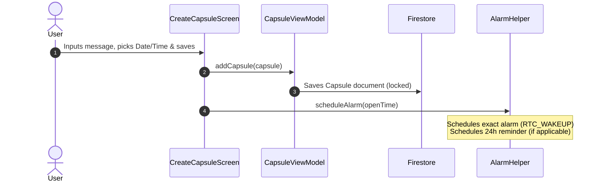

# 🌌 LegacyVault — Android Time Capsule Application

[](https://developer.android.com)
[](https://kotlinlang.org)
[](https://developer.android.com)
[](https://firebase.google.com)

> **Preserve your memories, thoughts, and reflections in a secure digital vault—to be opened only when the designated future moment arrives.**

---

## 📖 Overview

**LegacyVault** is a premium, high-fidelity Android application built using modern Android development best practices. It allows users to write personal letters, log motivations, and create reminders as digital "Time Capsules". These capsules are securely sealed and remain locked, showing a live ticking countdown, until their precise future unlock time is reached. 

Designed with a sleek, premium dark-mode aesthetic and smooth micro-animations, the app integrates real-time synchronization, state-driven UI updates, a robust background notification engine, and deep emotional analytics.

---

## ✨ Features

### 🔒 Core Vault Features
*   **Time Capsule Creation:** Seal messages with specific dates, times, categories, and custom access rights.
*   **Locked & Opened States:** Real-time state division. Capsules automatically migrate from **Locked** to **Opened** the exact second their timers hit zero.
*   **Live Countdown Timers:** High-frequency UI updates rendering precise countdowns (`Days : Hours : Minutes : Seconds`) for all active capsules.
*   **Security & Unlock Keys:** Optional passwords/keys to add an extra layer of privacy to sensitive memories.
*   **Shared Capsules:** Support for collaborative vaults, allowing shared capsules to sync across multiple users via email lists.

### 🔔 Smart Background Engine
*   **Precise Alarm Scheduling:** Employs Android's native `AlarmManager` (`RTC_WAKEUP`) for exact execution, even if the device is sleeping or the application is closed.
*   **Smart Reminders:** Automatically calculates and schedules a pre-unlock reminder (24 hours prior) for long-term capsules, alongside the primary unlock alert.
*   **Notification Channel Management:** Uses custom high-priority Android Notification Channels to deliver vibrant, rich push alerts when capsules are ready.
*   **Periodic Fallback Sync:** Uses Android `JobScheduler` (`CapsuleJobService`) running every 15 minutes to guarantee database sync and status resolution in the background.

### 📊 Vault Insights & Reflection Logger
*   **Interactive Analytics Dashboard:** Beautifully visualizes progress using an animated circular progress indicator and linear bar charts showing category distributions (Personal, Motivation, Reminder).
*   **Emotion & Reflection Logging:** Upon opening a capsule, users can log their emotional response (using premium, animated emoji selectors) and write retrospective notes.
*   **Historical Trends:** Tracks emotional distributions over time, transforming a simple vault into an impactful self-reflection and mental-wellness tool.

### 🎨 Visuals & UX
*   **Harmonious Color Palette:** Sleek dark-mode aesthetic powered by deep space colors (Midnight Blue `#16213E`, Royal Violet `#1A1A2E`, and Crimson Rose `#E94560`).
*   **Fluid Transitions:** Custom Compose animations, including circular progress fills, sliding drawer navigations, and tactile button feedback.

---

## 🛠️ Tech Stack & Dependencies

LegacyVault is built using a modern, reactive tech stack aligned with Google's recommended architecture guidelines:

| Technology Component | Description / Library Name | Version / BOM |
|:---|:---|:---|
| **Programming Language** | Kotlin (Coroutines, Flow, StateFlow) | `v2.3.21` |
| **UI Framework** | Jetpack Compose (Declarative UI) | BOM `2026.05.00` |
| **Styling / Components**| Material Design 3 (M3) | M3 Standard |
| **Icons Library** | Jetpack Extended Material Icons | `v1.9.0` |
| **Navigation** | Navigation Compose | `v2.9.8` |
| **Local Storage** | Jetpack DataStore (Preferences API) | `v1.2.1` |
| **Serialization** | Kotlinx Serialization JSON | `v1.11.0` |
| **Cloud Database** | Firebase Firestore (Realtime NoSQL) | BOM `33.7.0` |
| **Authentication** | Firebase Authentication | BOM `33.7.0` |
| **Background Tasks** | `AlarmManager` + `JobScheduler` | Native Android APIs |

---

## 🏗️ Codebase Structure

```typescript
d:/app/app/src/main/java/com/timecapsule/app/
│
├── 📂 MainActivity.kt           # App entry point, starts periodic jobs & configures channels
│
├── 📂 data/
│   ├── 📂 model/
│   │   └── 📄 Capsule.kt        # Core Capsule entity model (supports custom categories & emotion logging)
│   │
│   ├── 📂 repository/
│   │   └── 📄 CapsuleRepository.kt # Firebase Firestore CRUD interface (handles owner-bound & shared queries)
│   │
│   └── 📂 datastore/
│       └── 📄 PreferenceManager.kt # Jetpack DataStore manager (stores dark mode states & local JSON cache)
│
├── 📂 viewmodel/
│   └── 📄 CapsuleViewModel.kt   # App brain; runs infinite coroutine ticks to check, unlock, & save capsule states
│
├── 📂 ui/
│   ├── 📂 theme/
│   │   ├── 📄 Color.kt          # Harmonious deep dark theme palette
│   │   ├── 📄 Theme.kt          # Dynamic light/dark mode setup
│   │   └── 📄 Type.kt           # Custom typography scaling
│   │
│   ├── 📂 components/
│   │   └── [Reusable Composables] # Buttons, custom charts, circular progress bars, and card items
│   │
│   └── 📂 screens/
│       ├── 📄 SplashScreen.kt   # Animated brand introduction
│       ├── 📄 LoginScreen.kt    # Firebase Auth email/password entry
│       ├── 📄 RegisterScreen.kt # New user registration & profile initialization
│       ├── 📄 MainScreen.kt     # App shell (TopBar, Nav Drawer, Pager controller)
│       ├── 📄 TabScreen.kt      # Horizontal pager managing sub-lists
│       ├── 📄 LockScreen.kt     # Renders locked capsules with live tick-by-tick countdown timers
│       ├── 📄 OpenedScreen.kt   # Lists unlocked memories
│       ├── 📄 CreateCapsuleScreen.kt # Date/Time picker & alarm-scheduling builder
│       ├── 📄 CapsuleDetailScreen.kt # Details view (message, unlock details, and security check)
│       ├── 📄 EmotionScreen.kt  # Post-unlock emotion reflection logger
│       ├── 📄 AnalyticsScreen.kt# High-fidelity dashboard visualizing insights & category charts
│       ├── 📄 ProfileScreen.kt  # User profile manager
│       └── 📄 SettingsScreen.kt # Configuration portal (Dark mode triggers, account logouts)
│
└── 📂 utils/
    ├── 📄 AlarmHelper.kt        # Direct AlarmManager interface (handles permission checks & pending intents)
    ├── 📄 AlarmReceiver.kt      # BroadcastReceiver triggering high-priority notification channels
    ├── 📄 CapsuleJobService.kt  # Periodic JobService maintaining background syncing (runs every 15 mins)
    ├── 📄 NotificationHelper.kt # Boilerplate for creating Android Notification Channels
    └── 📄 PermissionHelper.kt   # System-level utility managing permission states (notifications, exact alarms)
```

---

## 🔄 Core Architectural Workflows

### 1. Capsule Creation & Alarm Dispatch


### 2. Time-Based Background Unlocking
```mermaid
sequenceDiagram
    autonumber
    participant System as Android OS AlarmManager
    participant Recv as AlarmReceiver
    participant Note as NotificationHelper
    participant VM as CapsuleViewModel (App Foregrounded)
    participant DB as Firestore
    participant UI as LockedScreen/OpenedScreen

    System->>Recv: Alarm Time Reached! Triggers Receiver
    Recv->>Note: showNotification(title, message)
    Note-->>User: Pushes highly visible notification banner
    Note over VM: Coroutine ticks every 1000ms checking time
    VM->>VM: Detects currentTime >= openTime
    VM->>DB: Updates document state (isOpened = true)
    VM-->>UI: StateFlow updates; Capsule slides to Opened tab
```

---

## 🚀 Getting Started

### Prerequisites
*   Android Studio **Koala** (or newer)
*   JDK **17**
*   Android device/emulator running **Android 8.0 (API level 26) or higher**
*   A Firebase project with **Firestore Database** and **Authentication** enabled

### Setup Instructions
1.  **Clone the Repository:**
    ```bash
    git clone https://github.com/your-username/legacyvault.git
    cd legacyvault
    ```
2.  **Add Firebase Configuration:**
    *   Download your `google-services.json` file from your Firebase console.
    *   Place it in the application's module directory: `d:\app\app\google-services.json`.
3.  **Open in Android Studio:**
    *   Launch Android Studio and choose **Open Project**.
    *   Select the root directory (`d:\app`).
4.  **Sync and Compile:**
    *   Wait for Gradle Sync to complete.
    *   Click **Run** (`Shift + F10`) to build and deploy the app onto your target emulator or device.

---

## 🔒 Security & Best Practices
*   **Exact Alarms Permission:** The app implements safe fallback handlers on Android 12+ (API 31+) if exact alarm scheduling permission (`SCHEDULE_EXACT_ALARM`) is denied by the user.
*   **Firestore Rules:** The cloud database is secured such that users can only read/write capsules where they are either the `ownerId` or listed in the `sharedUsers` email array.
*   **PreferenceManager Resiliency:** Handles file read/write exceptions seamlessly in the DataStore stream, avoiding app crashes due to asynchronous stream disruptions.

---
*Developed with ❤️ as a modern, premium memory vault experience.*
